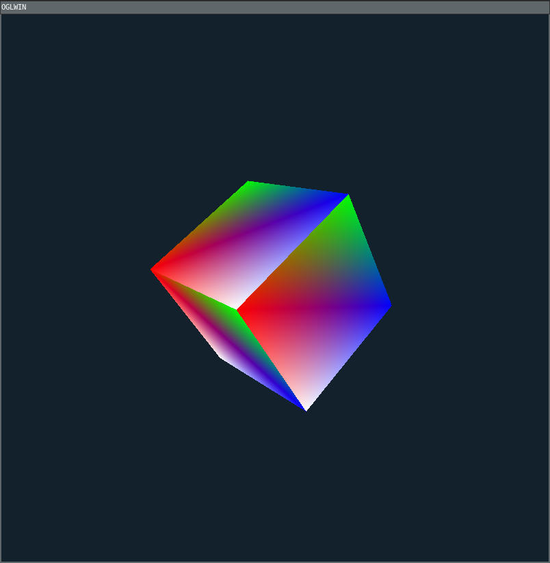

# OpenGL in Rust

<p align="center"></p>

This is a repository where I am learning OpenGL in Rust.

## How to build

Following crates are used in this repository.

```
$ cargo tree --depth 1
ogl v0.1.0
├── clap v4.4.7
├── error-stack v0.4.1
│   [build-dependencies]
├── gl33 v0.2.1
├── jlogger-tracing v0.1.4
├── khronos-egl v6.0.0
├── libc v0.2.150
├── libloading v0.8.1
├── libm v0.2.8
├── once_cell v1.18.0
├── rand v0.8.5
├── rustix v0.38.26
├── sdl2 v0.35.2
├── tempfile v3.8.1
├── wayland-client v0.31.1
├── wayland-egl v0.32.0
└── wayland-protocols v0.31.0
```

I am working on Ubuntu and I am not sure it is working on other platform or not. You can try it :).

You can build this repository as follow:

```
$ cargo build  --release
$ file target/release/ogl
target/release/ogl: ELF 64-bit LSB shared object, x86-64, version 1 (SYSV), dynamically linked, interpreter /lib64/ld-linux-x86-64.so.2, BuildID[sha1]=4534ce1684d2ea5f9bc1e04a4efedce773463241, for GNU/Linux 3.2.0, with debug_info, not stripped


```

Also you can build an aarch64 binary for RasPI4 by using docker as follow:

```
$ ./appsdk_builder --release
$ file target/aarch64-appsdk-linux/release/ogl
target/aarch64-appsdk-linux/release/ogl: ELF 64-bit LSB shared object, ARM aarch64, version 1 (SYSV), dynamically linked, interpreter /lib/ld-linux-aarch64.so.1, BuildID[sha1]=f93570ad75b259bff6782f2e33a435691ecc75c7, for GNU/Linux 3.14.0, with debug_info, not stripped
```

## How to run

The usage of the executable "ogl" is as following:

```
$ ./target/release/ogl -h
Usage: ogl [OPTIONS] <--wayland|--sdl|--list-func>

Options:
  -w, --window <WINDOW>  [default: 800x800]
  -W, --wayland
  -S, --sdl
  -l, --list-func
  -f, --func <FUNC>      [default: 21]
  -t, --time-stamp
  -v, --verbose...
  -h, --help             Print help
  -V, --version          Print version
```

You can run _ogl_ through SDL2 as following:

```
$ ./target/release/ogl -w 800x800 -S
```

Also, if you have a Wayland environment, you can run it as following:

```
$ ./target/release/ogl -w 800x800 -W

```

Please make sure _XDG_RUNTIME_DIR_ and _WAYLAND_DISPLAY_ are set correctly.

Of course you can run SDL2 over Wayland if you like ...

```
$ SDL_VIDEODRIVER=wayland ./target/release/ogl -w 800x800 -S
```

As I escribed above, I am using this repository to learn OpenGL with Rust. I
write some exercises. These exercises are stored under the _src/drawfunc/_
directory and a number is assigned for each exercise.

```
$ ./target/release/ogl -l
  INFO All functions:
  INFO   1 DrawVbo
  INFO   2 DrawVbo2
  INFO   3 DrawVboVertexColor
  INFO   4 DrawVboVertexColor2
  INFO   5 DrawVaoVertexColor
  INFO   6 DrawVaoVertexColor2
  INFO   7 DrawVaoVertexColorElement2
  INFO   8 DrawCircle
  INFO   9 DrawComplex
  INFO  10 DrawWithoutVbo
  INFO  11 DrawLines
  INFO  12 DrawPrimitiveRestart
  INFO  13 DrawProvokingVertex
  INFO  14 DrawInstance
  INFO  15 DrawInstance2
  INFO  16 DrawTriangleStrip
  INFO  17 DrawModelViewProjection
  INFO  18 DrawTexture
  INFO  19 DrawTexture2
  INFO  20 DrawTexture3
  INFO  21 DrawTextureMipMapping
  INFO  22 DrawTextureCubeMap
```

You can run the specific exercise by specify the number with _-f_ option. For
example, following run the exercise which implement primitive restart usage.

```
./target/release/ogl -w 800x800 -S -f 12
```

By default, _DrawTextureMipMapping_ is executed which draws a rotating cube.
